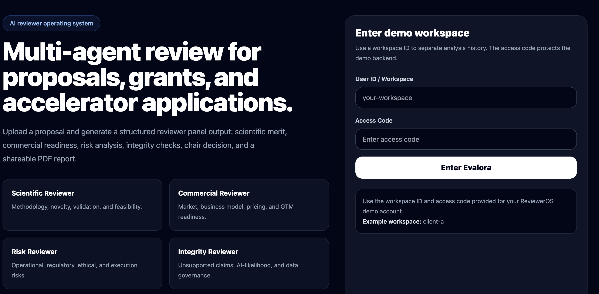
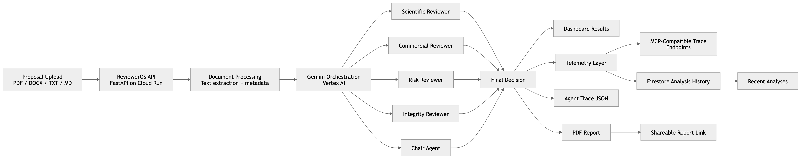
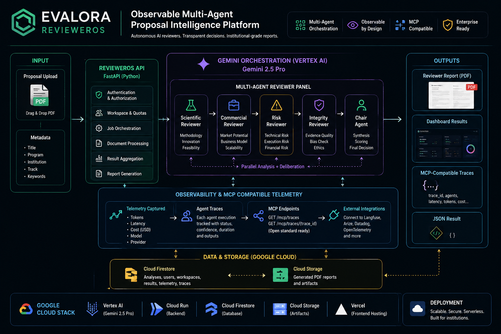

# Evalora ReviewerOS

**Observable multi-agent proposal intelligence platform powered by Gemini, Vertex AI, and Google Cloud.**



Evalora ReviewerOS is an institutional-grade AI reviewer workspace that evaluates grant proposals, accelerator applications, innovation projects, and research submissions through a specialized multi-agent reviewer panel.

It moves beyond chat by orchestrating multiple AI agents, analyzing uploaded documents, generating structured reviewer decisions, producing shareable PDF reports, enforcing workspace quotas, and exposing MCP-compatible observability traces for runtime inspection.

---

# Google Cloud Rapid Agent Hackathon

| Category | Value |
|---|---|
| Hackathon | Google Cloud Rapid Agent Hackathon |
| Partner Track | Arize |
| Project Type | Observable Multi-Agent Decision Intelligence Platform |
| AI Runtime | Gemini 2.5 Pro |
| AI Platform | Vertex AI |
| Deployment | Google Cloud Run + Vercel |
| Observability | MCP-compatible trace layer |

---

# Live Demo

| Resource | Link |
|---|---|
| Hosted App | `https://evalora.com.tr` |
| Frontend | `https://revieweros.vercel.app` |
| Backend API | `https://revieweros-api-933794864277.europe-west1.run.app` |
| Demo Video | `TODO: Add Loom / YouTube link` |
| Devpost Submission | `TODO: Add Devpost link` |

---

# The Problem

Institutions review thousands of proposals manually every year.

This process is:
- slow
- inconsistent
- difficult to scale
- expensive
- operationally opaque

Universities, accelerators, grant offices, and investment committees increasingly need AI-assisted review workflows that preserve transparency, auditability, and structured evaluation quality.

---

# The Solution

Evalora transforms proposal review into an observable multi-agent workflow.

A proposal is uploaded once, then specialized Gemini-powered reviewer agents:
- analyze the document
- evaluate scientific and commercial quality
- detect operational and integrity risks
- synthesize reviewer opinions
- generate structured institutional reports
- expose runtime telemetry and traceability

The system is designed to move beyond chat into actionable institutional AI orchestration.

---

# Core Features

## Multi-Agent Reviewer Panel

Evalora orchestrates specialized reviewer agents:

| Agent | Responsibility |
|---|---|
| Scientific Reviewer | Evaluates novelty, methodology, feasibility, technical rigor, and scientific validity |
| Commercial Reviewer | Assesses business model, GTM readiness, scalability, and adoption potential |
| Risk Reviewer | Identifies operational, execution, technical, financial, and compliance risks |
| Integrity Reviewer | Detects unsupported claims, AI-likelihood, governance gaps, and evidence weaknesses |
| Chair Agent | Produces the final institutional synthesis and recommendation |

---

## Observable Runtime

Every analysis produces structured runtime telemetry including:
- provider metadata
- model metadata
- trace identifiers
- token usage
- latency
- execution spans
- per-agent orchestration details

Telemetry is visible inside the dashboard through:
- Agent Trace panel
- downloadable trace JSON
- MCP-compatible runtime endpoints

---

## MCP-Compatible Trace Layer

Evalora exposes MCP-compatible observability endpoints:

```http
GET /mcp/traces
GET /mcp/traces/{trace_id}
```

---


# Architecture Overview



---

# Full System Architecture

